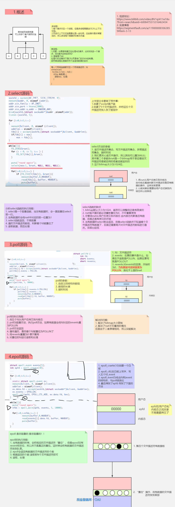

# toyhttpd源码分析

## 1.简介

本仓库是对开源的 `toyhtpd`的源码分析，其中`toyhtpd`:  是[code4wt](https://github.com/code4wt)实现的 I/O 模型练手代码，分别使用阻塞式 I/O、select、poll 和 epoll 和 Java NIO 实现了简单的 HTTP Server。


**总结**：通过阅读**toyhttpd**源码：

- [x] 因为其中内部复用了TinyHttp代码，加深了对HTTP报文结构以及 HTTP Server原理的理解。

- [x] 加深了对各种IO模型的理解。包括单进程的IO， 多线程的IO； IO复用模型(select, poll epoll)
- [ ] Java版本的还没有时间看 

这边简单做个整理，以后可以回来看。


## 2.参考博客与仓库：

> [toyhttpd仓库地址](https://github.com/code4wt/toyhttpd)
>
> [toyhttpd仓库博客地址](http://www.tianxiaobo.com/2018/03/02/%E5%9F%BA%E4%BA%8Eepoll%E5%AE%9E%E7%8E%B0%E7%AE%80%E5%8D%95%E7%9A%84web%E6%9C%8D%E5%8A%A1%E5%99%A8/)
>
> [参考博客：Tinyhttp源码详解(带注释)](https://blog.csdn.net/weibo1230123/article/details/80033252)
>
> [[参考博客：Tinyhttp源码分析](https://blog.csdn.net/yzhang6_10/article/details/51534409)


[toyhttpd仓库地址


## 3.原始简介

I/O 模型练手代码，分别使用阻塞式 I/O、select、poll 和 epoll 和 Java NIO 实现了简单的 HTTP Server。

原始仓库对应于 Java NIO 系列文章，文章地址为[http://www.coolblog.xyz/categories/foundation-of-java/NIO/](http://www.coolblog.xyz/categories/foundation-of-java/NIO/)

## 4.原始使用说明

### 4.1 C代码编译

C 代码可直接使用 make 命令编译，但因 epoll 相关接口是 Linux 系统特有的，所以应保证在 Linux 平台下编译。

### 4.2 

Java 代码并未依赖第三方 Jar 包，所以可直接使用 javac 命令编译。

```shell
cd java
javac xyz/coolblog/httpd/TinyHttpd.java
```


